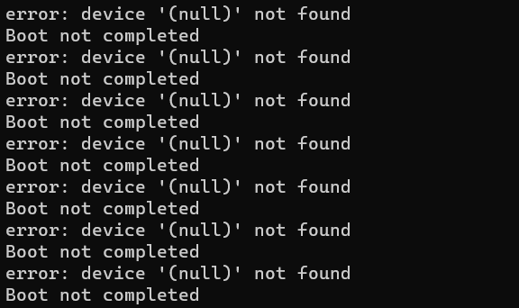

## `AndroPy_autorun.sh`

> Tested on Kali Linux & Ubuntu.

> There is a default installation for docker with `apt install docker.io`. But if it did not work, you should install docker manually before running the script if it is not available.

### Context: 

As you know, [AndroPyTool](https://github.com/alexMyG/AndroPyTool) made by [alexMyG](https://github.com/alexMyG/AndroPyTool/commits?author=alexMyG) is a "GOAT" for extracting features from APK files, extraction are processed in both **static** and **dynamic** method, including report from other sources like **VirusTotal**. 
- Also, we encounter problem with VirusTotal API requests quotas and other trivia things relating to running tool by docker container

### Functionality: 

This script will help you: 
- Skip the analysing file if the extracting process is failed
- Check whether VirusTotal API Key limit is still available. If that key have reached the quota, you have to add a new key for continual process. (There is a default key in this script). You should always monitor and be aware of the remaining available requests
- By default, the script will execute with `-all` and `-vt` option for fully extracting
- Print out the number of files successfully extracted and the failures.

### Command: 

Warnings: If you install docker with root privilege, you should use `sudo` when running this script.
```
./AndroPy_autorun.sh [SRC_DIR] [DES_DIR]
```

Use `-h` for more information.

- `[SRC_DIR]`: where apk files stored
- `[DES_DIR]`: where you store you results

`AndroPy_autorun_v2.sh` is executed without any interacting or input 

`test_apks` folder contains APKs for tesing (1 benign and 1 malware)

### Something worth noting ?

1. Sometimes, you may encounter this endless loop prevents you achieve the result

<p align="center"> 
    
</p>

> Reason: This is sometimes due to that APK files. Somes times because of **full memory** or **full disk**. Check it with `free -h` and `df -h`

Then you just `Ctr + C` (Windows & Unix-based) **once** or using anything to send a **SIGINT** signal, which cancels or terminates the currently-running program. After that, the extracting process would be on track again. 

Just **once** guys, if you keep doing then, you would stop the whole process. 

And remember to frequently keep track of whether this problem may be appear.

2. When you run long enough at once, you may experience low performance. 

My suggestion is splitting the current folder containing APK files into smaller ones. Refer to [Split Folder](https://github.com/khangtictoc/Android_malware_classification/blob/main/scripts/split-folder.py) or any tools suit to you
